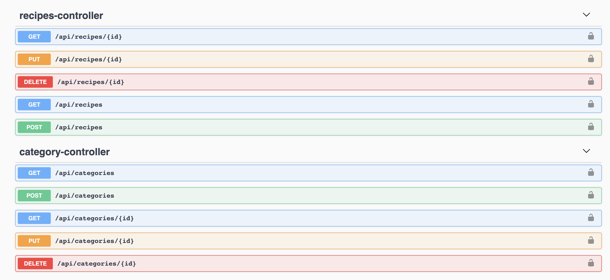
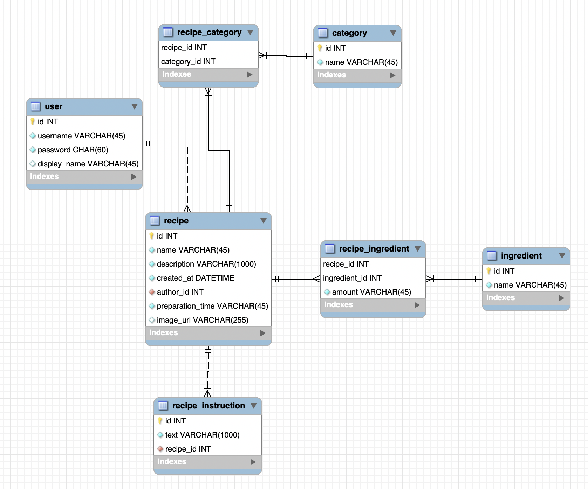
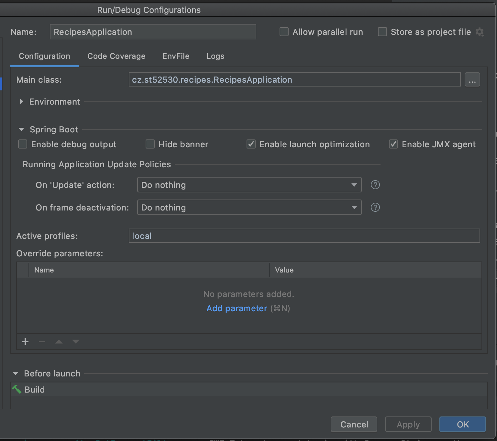

# Recepty - NNPIA Semestrální práce


Tento repozitář obsahuje zdrojové kódy backendu (spring boot) semestrální práce na předmět NNPIA.

## Téma

Tématem semestrální práce bylo vytvoření webové aplikace na správu receptů. Aplikace uživatelům umožňuje správu
vlastních receptů. Nejedná se o sociální platformu, kde by uživatelé recepty sdíleli a sbírali lajky. Jedná se o soukromé
úložiště receptů jednotlivých uživatelů. Recepty je možné i vyhledávat pomocí názvu.

U každého receptu je možné nastavit:
- unikátní obrázek,
- název,
- krátký popis/představení receptu,
- celkovou dobu přípravy,
- vybrat jednu nebo více kategorií do které recept patří,
- vybrat potřebné ingredience včetně potřebného množství (ať už se jedná o 1 kg nebo 1 hrnek),
- a také napsat postup v rámci několika kroků, které budou vizuálně odděleny.

### Plány do budoucna

Do budoucna bych rád na hlavní stránku přidal filtrování receptů pomocí kategorií. Také bych rád vylepšil vyhledávání
receptů - aby nebylo jedinou možností hledat podle názvu, ale také třeba podle kategorií nebo ingrediencí.

Dalším plánem je přidání podpory na sdílení receptů mezi uživateli. Pořád by se primárně jednalo o vybranou platformu,
ale vybrané recepty by šly sdílet s ostatními uživateli.

Nakonec bych chtěl více omezit registraci nových uživatelů, protože aplikace byla vyvjíjena pro interní použití
a ne pro veřejnost. To by mohlo znamenat, že pokud se bude chtít uživatel registrovat, tak bude muset do formuláře
vyplnit i nějaký tajný registrační řežezec.

## Pár slov o backendu

Backend (tudíž kódy v tomto repozitáři) byl napsán v programovacím jazyku Kotlin pomocí frameworku Spring Boot.
Projekt využívá MySQL databáze pro běh a in-memory H2 databáze pro běh testů. Pro migrace databáze byla zvolena knihovna Flyway.

Backendová část aplikace nevyužívá žádný template engine a veškterá komunikace s klientem (view) probíhá přes REST API.
Většina API dotazů na server vyžaduje autentizaci pomocí JWT tokenu v hlavičce každého dotazu. Dokumentace API je k dispozici na
[tomto odkazu](https://nnpia.herokuapp.com/swagger) pomocí nástroje Swagger.



### Databáze

Jak již bylo řečeno jako databáze byla použita MySQL. Aktuální struktura databáze obsahuje 7 tabulek. Jedna tabulka obsahuje
informace o uživatelích a zbytek tabulek řeší data potřebná k tvorbě receptů.

Jak již bylo dříve řečeno každý recept může být součástní jedné nebo více kategorií a také může obsahovat jednu nebo více ingrediencí.
Protože se postup receptu zapisuje jako posloupnost dílčích kroků, tak jsou kroky drženy ve své vlastní tabulce.



### Nahrávání obrázků

Nahrávání obrázků bylo na API vrstvě vyřešeno standardně pomocí multipart formdata. Ale tyto obrázky byly dále odeslány do
služby [Cloudinary](https://cloudinary.com/). Díky této službě se v databázi vždy drží pouze URL na obrázek receptu a při načítání
obrázku z klienta request vůbec nejde přes tento backend.

### Kód

Jak již bylo řečeno kód aplikace je napsán v Kotlinu. Některé testy jsou v Groovy a třída Creator pro vytváření dat pro testy
byla ponechána v Javě. Tyto 3 jazyky bez problému všechny spolupracují v rámci jednoho projektu.

Hlavní kód aplikace byl rozdělen do několika balíčků:
- **config -** obsahuje konfiguraci pro spring boot (např. CORS, swagger nebo poskytování závislotí),
- **controller -** obsahuje všechny rest controllery,
- **dao -** obsahuje JPA repositories,
- **extensions -** obsahuje Kotlin extension funkce,
- **model -** obsahuje datové modely (entity/DTO, ...),
- **security -** obsahuje JTW security třídy,
- **service -** obsahuje všechny services,
- **util -** obsahuje utility třídy.

## Spuštění

Pro spuštění projektu otevřete tutu složku v IntelliJ IDEA a přidejte následující konfiguraci:
- Main class: `cz.st52530.recipes.RecipesApplication`
- Active profiles: `local`



Dále budete potřebovat soubor `application-local.properties`, ve kterém nakonfigurujete vaše prostředí.
Tento soubor vložte do složky resources vedle standardního `application.properties`. Následuje příklad konfigurace:

```properties
# Příklad konfigurace:

# Database connection string.
spring.datasource.url=jdbc:mysql://localhost:3306/recipes?serverTimezone=Europe/Prague
# Database user.
spring.datasource.username=user
# Database password.
spring.datasource.password=pass

# Flyway.
# Database connection string - without the schema specification.
spring.flyway.url=jdbc:mysql://localhost:3306/?serverTimezone=Europe/Prague
# Schema for migrations (this line makes sure that the schema will be created automatically if it does not exist..
spring.flyway.schemas=recipes
# Database user for migrations.
spring.flyway.user=user
# Database password for migrations.
spring.flyway.password=pass

# Security.
# Secret value for generating JWT tokens. 
jwt.secret=jwt-secret-value

# Cloudinary (optional).
# Your cloud name.
cloudinary.cloud_name=cloud-name-value
# Your api key.
cloudinary.api_key=api-key-value
# Your api secret.
cloudinary.api_secret=api-secret
```